# Deteksi Covid-19 dari Citra X-Ray Paru-Paru Menggunakan Deep Learning Berbasis Convolutional Neural Network dengan VGGNet16

Disusun Oleh:  
Zaenal Syamsyul A (2206067) 
Della Awalia Fitriah (2206123) 

# BAB I PENDAHULUAN  
COVID-19 adalah penyakit pernapasan yang disebabkan oleh virus SARS-CoV-2 dan telah menjadi pandemi global yang berdampak luas pada sektor kesehatan. Penyakit ini menyerang sistem pernapasan dan dapat menyebabkan pneumonia berat, yang ditandai dengan peradangan pada paru-paru dan kesulitan bernapas. Deteksi dini COVID-19 menjadi sangat penting untuk mengurangi tingkat keparahan penyakit dan angka mortalitas. Salah satu metode utama dalam diagnosis COVID-19 adalah pencitraan medis seperti X-ray paru-paru, yang dapat menunjukkan karakteristik khas pneumonia akibat infeksi virus ini (Usama et al., 2020). Namun, analisis citra X-ray secara manual oleh radiolog memiliki beberapa keterbatasan, seperti subjektivitas dalam penilaian, keterbatasan tenaga ahli, serta waktu yang dibutuhkan dalam diagnosis. Oleh karena itu, diperlukan pendekatan berbasis kecerdasan buatan yang dapat meningkatkan efisiensi dan akurasi deteksi COVID-19(Sharma & Guleria, 2022). 

Deep learning, khususnya Convolutional Neural Network (CNN), telah menunjukkan potensi besar dalam analisis citra medis, termasuk deteksi COVID-19 dari X-ray paru-paru. Beberapa penelitian sebelumnya telah mengembangkan model deep learning untuk mendeteksi pneumonia dan COVID-19 dengan tingkat akurasi yang tinggi. Misalnya, model ResNet-50 yang digunakan dalam penelitian sebelumnya telah mencapai akurasi hingga 98.18% dalam membedakan COVID-19 dari pneumonia lainnya (Usama et al., 2020). Selain itu, model VGG-16 dengan neural networks memperoleh akurasi 95.4%, yang lebih baik dibandingkan kombinasi dengan metode lain seperti Support Vector Machine (SVM) dan K-Nearest Neighbor (KNN) (Sharma & Guleria, 2022). Studi lainnya menggunakan CNN dengan dataset besar berisi 20.000 gambar X-ray, yang menunjukkan akurasi 95% dalam mendeteksi COVID-19, pneumonia bakteri, dan pneumonia virus(Dr. Sunil L. Bangare et al., 2022).  

Meskipun berbagai model deep learning telah dikembangkan, masih terdapat beberapa tantangan dalam penerapan model ini untuk deteksi COVID-19, seperti keterbatasan jumlah dataset, variasi dalam kualitas pencitraan X-ray, serta interpretabilitas model yang masih terbatas bagi tenaga medis. Oleh karena itu, penelitian ini bertujuan untuk mengembangkan model deep learning berbasis CNN yang mampu mendeteksi COVID-19 dengan akurasi tinggi dari citra X-ray paru-paru. Dengan menggunakan arsitektur ResNet-50, penelitian ini memanfaatkan teknik transfer learning untuk meningkatkan akurasi klasifikasi dengan dataset terbatas(Usama et al., 2020). Selain itu, penelitian ini juga mengevaluasi efektivitas teknik augmentasi data dalam meningkatkan performa model. Hasil dari penelitian ini diharapkan dapat memberikan kontribusi dalam pengembangan sistem diagnosis berbasis kecerdasan buatan yang dapat membantu tenaga medis dalam mengidentifikasi COVID-19 secara lebih cepat dan akurat (Sharma & Guleria, 2022).  

# BAB II METODE PENELITIAN  
Berdasarkan masalah sebelumnya, peneliti menggunakan metode VGG16 dan telah menetapkan kerangka kerja untuk mengatasi masalah tersebut. Kerangka pemikiran penelitian diuraikan sebagai berikut pada Gambar 1(Fitriani et al., 2024)  

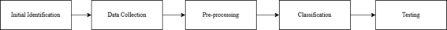  

Gambar 1 dapat dijelaskan sebagai berikut:  

1. Identifikasi Awal  
Pada tahap identifikasi awal, dilakukan tinjauan literatur terhadap penelitian yang relevan mengenai klasifikasi citra X-ray paru-paru menggunakan Jaringan Saraf Tiruan (JST) dan deep learning. Selama proses tinjauan literatur, penelitian sebelumnya dianalisis untuk mengevaluasi model yang telah digunakan, mengidentifikasi permasalahan yang dihadapi dalam deteksi COVID-19, serta menelaah solusi yang telah dikembangkan. Diskusi juga dilakukan dengan pembimbing untuk memperoleh umpan balik dan saran mengenai pendekatan yang diusulkan dalam penelitian ini. Selain itu, konsultasi dengan tenaga medis dan pakar di bidang radiologi dilakukan guna memastikan bahwa penelitian ini dapat memberikan kontribusi yang signifikan dalam membantu proses diagnosis COVID-19 berbasis pencitraan medis.  

2. Pengumpulan Data  
Pada tahap pengumpulan data, peneliti mengumpulkan data yang relevan untuk penelitian ini dan menganalisis kumpulan data yang dikumpulkan untuk memungkinkan klasifikasi. Proses pengumpulan data difokuskan untuk mendapatkan kumpulan data yang terdiri dari gambar X-ray paru-paru. Selanjutnya, analisis dilakukan untuk mempersiapkan tahap pre-processing selanjutnya.  

3. Pra-pemrosesan  
Tahap pra-pemrosesan dalam penelitian ini melibatkan normalisasi dan augmentasi data dari kumpulan gambar rontgen dada yang diperoleh dari Kaggle (https://www.kaggle.com/datasets/khoongweihao/covid19-xray-dataset-train-test-sets), Normalisasi dilakukan untuk mengubah data gambar ke dalam format yang dapat diproses secara optimal oleh model ResNet-50. Setelah normalisasi, augmentasi data diterapkan untuk meningkatkan variasi sampel dalam set pelatihan dan mengurangi risiko overfitting. Teknik augmentasi yang digunakan meliputi flipping horizontal, rotasi acak, zoom acak, perubahan pencahayaan, dan warp acak. Seluruh gambar dikonversi ke ukuran 224×224 piksel sebelum digunakan dalam pelatihan model(Usama et al., 2020).  

4. Klasifikasi  
Peneliti melakukan klasifikasi pada dataset yang telah diproses sebelumnya. Selanjutnya, implementasi arsitektur VGGNet pada Gambar 4 dan proses pelatihan dimulai. Implementasi arsitektur VGGNet merupakan komponen penting dari Convolutional Neural Network (CNN), seperti yang ditunjukkan pada Gambar 4 (Fitriani et al., 2024).Setelah dibangun, arsitektur tersebut menjalani pelatihan, menghasilkan model yang siap untuk pengujian dan klasifikasi gambar.  
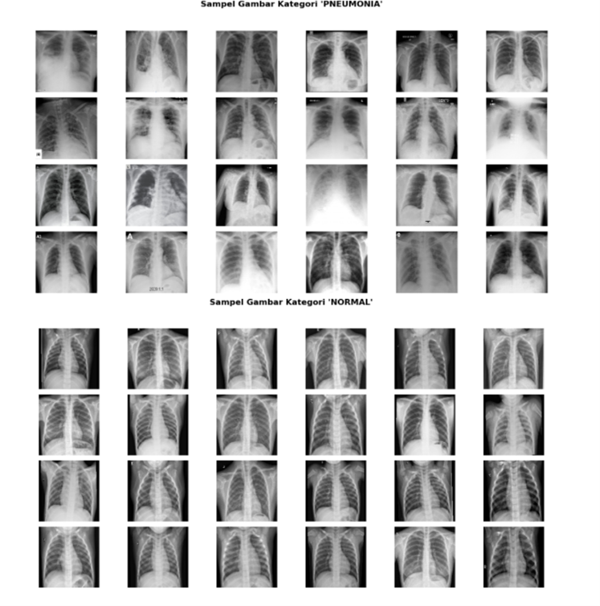  
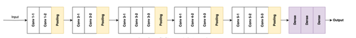  
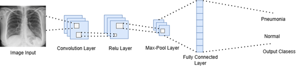  

# BAB III HASIL DAN PEMBAHASAN  
## 3.1 IDENTIFIKASI MASALAH  
Pada Bagian ini , ada beberapa proses dilakukan untuk memahami klasifikasi gambar menggunakan Convolutional Neural Network (CNN). Fase ini dimulai dengan mengidentifikasi subjek penelitian, yaitu klasifikasi gambar X-Ray untuk mendeteksi COVID-19 dan Pneumonia. Selanjutnya, fokus penelitian dialihkan untuk mendapatkan masalah penelitian melalui tinjauan literatur, yang memungkinkan pendekatan yang lebih terarah terhadap topik penelitian.  

Setelah melakukan tinjauan literatur, peneliti melakukan wawancara dengan tim medis di rumah sakit setempat. Wawancara ini menyimpulkan bahwa diagnosis COVID-19 dan Pneumonia masih dilakukan secara manual oleh tenaga medis dengan menganalisis gambar X-Ray. Proses ini memakan waktu dan rentan terhadap kesalahan manusia. Oleh karena itu, diperlukan sistem otomatis yang dapat membantu tenaga medis dalam mendeteksi COVID-19 dan Pneumonia secara cepat dan akurat.  

## 3.2 PENGUMPULAN DATA  
Proses pertama adalah pengumpulan data, yang akan dikumpulkan sesuai dengan tema penelitian, yaitu klasifikasi gambar X-Ray untuk COVID-19 dan Pneumonia. Data yang dikumpulkan terdiri dari dua kategori utama: gambar X-Ray pasien COVID-19 dan gambar X-Ray pasien Non-COVID-19 (Normal). Data gambar diperoleh dari sumber dataset publik, yaitu Kaggle ( https://www.kaggle.com/datasets/khoongweihao/covid19-xray-dataset-train-test-sets ). Dataset ini terdiri dari dua subset, yaitu data pelatihan (train) dan data pengujian (test). Total data yang diperoleh adalah 188 gambar, dengan distribusi yang seimbang antara kategori COVID-19 dan Non-COVID-19. 

Pada fase analisis data, gambar X-Ray yang terkumpul akan dibagi menjadi beberapa subset untuk melatih model klasifikasi gambar. Data yang diperoleh terdiri dari dua label, yakni COVID-19 dan Non-COVID-19, dengan total 188 gambar yang dibagi menjadi tiga bagian. Data pelatihan (training data) mencakup 70% dari total data, yaitu sebanyak 132 gambar, sementara data validasi (validation data) terdiri dari 20% atau 38 gambar, dan data pengujian (testing data) sebanyak 10% atau 18 gambar. Pembagian data ini dilakukan untuk memastikan bahwa model yang dikembangkan dapat dilatih, divalidasi, dan diuji dengan baik, sehingga menghasilkan model klasifikasi yang akurat(Gao, 2020)  

## 3.3 Pre-Processing  
Pre-processing data adalah langkah awal yang penting dalam pengembangan model deep learning untuk klasifikasi gambar medis. Pada penelitian ini, pre-processing diterapkan pada dataset gambar X-Ray untuk membedakan antara pasien dengan PNEUMONIA (COVID-19) dan NORMAL. Berikut adalah langkah-langkah pre-processing yang dilakukan untuk memastikan kualitas data dan efisiensi pelatihan model.  
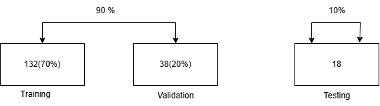  
  

1. Resizing Gambar  
Gambar dalam dataset ini memiliki ukuran yang bervariasi, yang dapat mempengaruhi performa model jika dibiarkan dalam ukuran aslinya. Oleh karena itu, setiap gambar diubah ukurannya menjadi 150x150 piksel. Penyesuaian ini memastikan bahwa seluruh gambar memiliki dimensi yang seragam, yang penting untuk pemrosesan batch pada model convolutional neural network (CNN). Resizing gambar juga mengurangi kompleksitas perhitungan dan mempercepat waktu pelatihan model.  

2. Normalisasi Gambar  
Sebagian besar model deep learning bekerja lebih efisien apabila nilai inputnya berada dalam rentang yang seragam. Oleh karena itu, setiap gambar yang dimuat diproses melalui normalisasi, di mana nilai piksel gambar yang awalnya berkisar antara 0 hingga 255 diubah menjadi rentang [0, 1]. Normalisasi ini dilakukan dengan membagi nilai piksel gambar dengan 255. Proses ini bertujuan untuk mempercepat proses konvergensi selama pelatihan dan mencegah masalah numerik yang disebabkan oleh perbedaan skala antara gambar-gambar dalam dataset.  

3. Augmentasi Gambar (Data Augmentation)  
Untuk meningkatkan kemampuan model dalam mengenali pola yang lebih umum dan mencegah terjadinya overfitting, dilakukan augmentasi data menggunakan ImageDataGenerator dari Keras. Augmentasi ini meliputi berbagai transformasi acak pada gambar, seperti rotasi, pergeseran horizontal, pemotongan acak, dan perubahan skala. Teknik augmentasi ini memperbanyak variasi gambar dalam dataset pelatihan, memungkinkan model untuk belajar dari variasi visual yang lebih beragam meskipun jumlah data asli terbatas. Hal ini juga membantu meningkatkan kemampuan model dalam generalisasi terhadap data yang belum terlihat sebelumnya.  

4. Pembagian Data ke dalam Set Pelatihan, Validasi, dan Pengujian  
Dataset dibagi menjadi tiga set utama, yaitu set pelatihan (training set), set validasi (validation set), dan set pengujian (test set). Pembagian ini dilakukan untuk memastikan bahwa model dilatih pada data yang berbeda dengan data yang digunakan untuk evaluasi. Set pelatihan digunakan untuk melatih model, set validasi untuk mengatur hiperparameter dan menghindari overfitting, dan set pengujian untuk mengevaluasi performa model pada data yang tidak pernah dilihat sebelumnya. Proporsi pembagian yang digunakan adalah 80% untuk pelatihan, 10% untuk validasi, dan 10% untuk pengujian.  

5. Labeling Gambar  
Dataset ini mengandung dua kategori label utama, yaitu PNEUMONIA (COVID-19) dan NORMAL. Setiap gambar dikategorikan berdasarkan kondisi medis yang tercermin dalam gambar X-Ray. Proses labeling dilakukan dengan memindahkan gambar ke direktori yang sesuai dengan label masing-masing, yaitu ke dalam folder PNEUMONIA atau NORMAL. Proses ini penting untuk memfasilitasi pelatihan model klasifikasi biner yang akan mengidentifikasi apakah gambar X-Ray menunjukkan tanda-tanda pneumonia atau tidak.  

6. Penggunaan Model Pre-trained (Transfer Learning)  
Untuk memaksimalkan kinerja model, teknik transfer learning diterapkan dengan memanfaatkan model pre-trained VGG16 yang telah dilatih pada dataset besar seperti ImageNet. Model VGG16 digunakan sebagai feature extractor tanpa fully connected layers dan hanya melatih beberapa lapisan terakhir untuk menyesuaikan dengan dataset COVID-19 dan Pneumonia. Transfer learning memungkinkan model untuk memanfaatkan pengetahuan yang sudah ada dalam pengenalan fitur umum pada gambar, yang sangat berguna untuk mempercepat pelatihan dan meningkatkan akurasi, terutama ketika dataset terbatas. Teknik ini juga memungkinkan model untuk belajar dengan lebih baik dan menghindari masalah pelatihan yang dapat muncul ketika memulai pelatihan dari awal.  

## 3.4 KLASIFIKASI
Setelah melalui tahap pre-processing, kini saatnya masuk ke fase klasifikasi. Data yang telah dipersiapkan akan diimplementasikan menggunakan arsitektur Deep Learning yang disebut Convolutional Neural Network (CNN), dan salah satu jenis arsitektur CNN yang digunakan adalah VGGNet. Berikut merupakan Flowchart Untuk Image Classfication ini :  
  

1. Implementasi Arisitektur VGGNet16  
Pada tahap implementasi arsitektur VGGNet, peneliti menggunakan arsitektur VGGNet-16. Arsitektur VGGNet memiliki berbagai konfigurasi, seperti VGGNet-19 dan VGGNet-16. Angka tersebut menunjukkan jumlah total lapisan dalam arsitektur. Secara spesifik, VGGNet-16 terdiri dari 13 lapisan konvolusi dan tiga lapisan fully connected. VGGNet 16 Pada Pemodelan ini dapat dilihat pada Gambar 8  
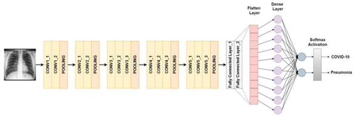  

2. Training  
Langkah selanjutnya adalah tahap pelatihan model. Pada tahap ini, arsitektur yang telah dibangun akan melalui proses kompilasi. Sebelum memasuki tahap model fitting, diperlukan beberapa persiapan, termasuk penerapan callback. Fungsi callback memberi tahu model untuk menghentikan pelatihan ketika target tertentu telah tercapai. Selanjutnya, masuk ke tahap model fitting, di mana model menjalani proses pelatihan oleh mesin pemodelan. Dalam proses ini, digunakan fungsi aktivasi binary cross-entropy serta optimasi Adam untuk meningkatkan kinerja model. Berikut Merupakan Hasil dari training model pada Tabel di bawah  
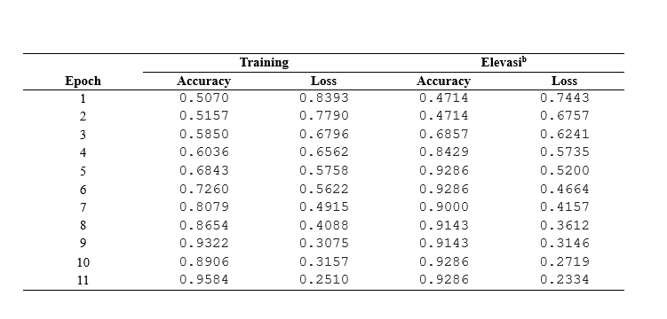  
Tabel 1 ini menunjukkan hasil proses pelatihan model selama 11 epoch dengan metrik utama seperti accuracy, loss, serta accuracy dan loss pada data validasi (Elevasib). Pada Epoch 1, akurasi pelatihan masih rendah (50.70%) dengan loss tinggi (0.8393), sementara akurasi validasi lebih rendah (47.14%) dengan loss 0.7443, menandakan bahwa model masih dalam tahap awal pembelajaran. Seiring bertambahnya epoch, model mulai mengenali pola dengan lebih baik, terlihat pada Epoch 3 dengan akurasi pelatihan 58.50% dan validasi 68.57%. Pada Epoch 5, akurasi pelatihan mencapai 68.43%, sedangkan akurasi validasi melonjak hingga 92.86%, menunjukkan peningkatan signifikan. Memasuki Epoch 9, akurasi pelatihan meningkat hingga 86.54%, sementara akurasi validasi sedikit menurun ke 90.00%, namun kembali naik pada Epoch 10 dengan akurasi pelatihan 89.06% dan validasi 92.86%. Pada Epoch 11, model mencapai akurasi pelatihan tertinggi sebesar 95.84% dengan loss rendah (0.2510), sementara akurasi validasi tetap stabil di 92.86% dengan loss semakin menurun ke 0.2334. Secara keseluruhan, model menunjukkan peningkatan yang stabil dengan loss yang terus menurun serta akurasi validasi yang tetap tinggi setelah Epoch 5, menandakan bahwa model telah belajar dengan baik dan mampu melakukan klasifikasi dengan tingkat akurasi yang tinggi tanpa indikasi overfitting yang signifikan.  
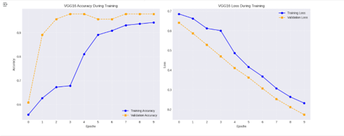  
Gambar 9 menampilkan dua grafik yang menggambarkan performa model VGG16 selama pelatihan, dengan grafik kiri menunjukkan akurasi dan grafik kanan menunjukkan loss terhadap jumlah epoch. Pada grafik akurasi, training accuracy meningkat secara bertahap, sementara validation accuracy mengalami peningkatan cepat di awal sebelum akhirnya stabil, menunjukkan bahwa model dengan cepat memahami pola dalam data validasi dan mencapai performa optimal. Pada grafik loss, baik training loss maupun validation loss mengalami penurunan konsisten, yang menandakan bahwa model semakin baik dalam memprediksi data. Penurunan validation loss yang lebih cepat di awal, namun tetap mengikuti tren training loss, menunjukkan bahwa model tidak mengalami overfitting yang signifikan. Secara keseluruhan, model VGG16 ini menunjukkan hasil pelatihan yang stabil dan optimal, dengan akurasi tinggi dan loss rendah setelah beberapa epoch, yang menandakan model telah berhasil belajar dari data secara efektif. 

## 3.5 Testing
Pengujian adalah tahap akhir dalam penelitian ini, di mana model yang telah dilatih dievaluasi menggunakan beberapa metrik yang umum digunakan untuk menilai kinerjanya. Evaluasi ini bertujuan untuk menentukan apakah model siap untuk pengembangan lebih lanjut atau aplikasi, serta apakah dapat dipublikasikan dan digunakan oleh pengguna. 

Selama pengujian, model diberikan citra atau sampel data dari test dataset yang belum pernah ditemukan selama fase pelatihan. Selanjutnya, model menghasilkan prediksi atau klasifikasi berdasarkan sampel data yang belum pernah dilihat sebelumnya. Prediksi ini kemudian dibandingkan dengan label asli atau nilai ground truth dari data uji untuk menilai kinerja model. 

Pengujian pertama dilakukan menggunakan citra X-ray. Hasil prediksi model dapat dilihat pada Gambar. Pengujian kedua dilakukan menggunakan citra ruangan berantakan. Hasil prediksi model untuk pengujian ini dapat dilihat pada Gambar 10.  
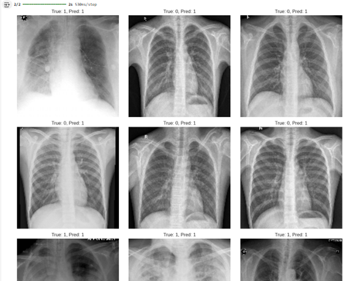  

Setelah melakukan pengujian langsung pada data citra X-ray dada, langkah terakhir adalah mengevaluasi kinerja model menggunakan confusion matrix, yang merupakan salah satu metode untuk menilai performa model klasifikasi. Evaluasi model berdasarkan confusion matrix dapat direpresentasikan dalam bentuk Gambar 10. 

Dalam Gambar 10, dapat diamati bahwa model sebagian besar memprediksi kasus sebagai positif (Pred: 1). Secara khusus, mayoritas gambar yang memiliki penyakit paru-paru (True: 1) diklasifikasikan dengan benar oleh model. Namun, terdapat beberapa kasus di mana model salah mengklasifikasikan gambar normal (True: 0) sebagai memiliki penyakit (Pred: 1), yang mengakibatkan false positive. 

Selain confusion matrix, kinerja model juga dievaluasi menggunakan metrik seperti precision, recall, dan F1-score. Metrik ini memberikan wawasan tentang kemampuan model dalam mengidentifikasi kasus positif dan negatif dengan benar. Hasil evaluasi termasuk akurasi, precision, recall, dan F1-score dapat dilihat pada Gambar 11. 
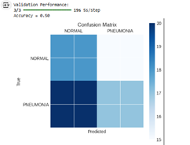 
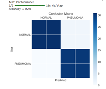  
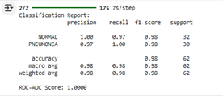  

Pada hasil evaluasi model, performa klasifikasi untuk dua kelas, yaitu NORMAL dan PNEUMONIA, dianalisis berdasarkan metrik-metrik utama seperti precision, recall, f1-score, dan support. Berikut penjelasan rinci dari masing-masing metrik beserta perhitungannya: 
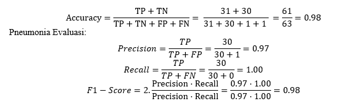  
Total Support : Total jumlah sampel untuk kategori PNEUMONIA adalah 30. 
Normal evaluasi:  
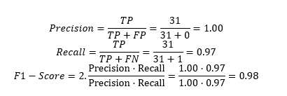  
Total Support : Total jumlah sampel untuk kategori NORMAL adalah 32.  

Model yang dievaluasi menunjukkan kinerja klasifikasi yang sangat baik dengan nilai akurasi sebesar 98%. Akurasi ini dihitung berdasarkan jumlah True Positives (TP) dan True Negatives (TN) yang dibagi dengan total jumlah sampel. Dalam hal ini, hasilnya adalah 61 (TP kategori NORMAL dan PNEUMONIA) dibagi dengan 63 (jumlah total sampel), yang menghasilkan akurasi 0,98 atau 98%. Hal ini menunjukkan bahwa model dapat mengklasifikasikan sebagian besar sampel dengan benar.  

Untuk kategori NORMAL, model menunjukkan kinerja yang sangat baik. Precision untuk kategori ini adalah 100%, yang berarti bahwa semua sampel yang diklasifikasikan sebagai NORMAL benar-benar merupakan kasus NORMAL. Recall, atau sensitivitas, untuk kategori ini adalah 97%, yang berarti bahwa model berhasil mengidentifikasi 97% dari seluruh sampel NORMAL yang ada. F1-Score untuk kategori NORMAL adalah 98%, yang menunjukkan keseimbangan yang sangat baik antara precision dan recall dalam mendeteksi kategori ini.  

Begitu pula dengan kategori PNEUMONIA, model juga menunjukkan performa yang sangat baik. Precision untuk kategori PNEUMONIA adalah 97%, yang berarti bahwa hampir semua sampel yang diklasifikasikan sebagai PNEUMONIA benar-benar berasal dari kategori tersebut. Recall untuk kategori ini adalah 100%, yang menunjukkan bahwa model berhasil mengidentifikasi seluruh sampel PNEUMONIA tanpa ada yang terlewat. F1-Score untuk kategori PNEUMONIA juga mencapai 98%, mencerminkan keseimbangan yang baik antara precision dan recall. 

Secara keseluruhan, model ini memiliki performa yang sangat baik dalam mendeteksi kedua kategori, NORMAL dan PNEUMONIA. Dengan nilai akurasi yang tinggi dan skor precision, recall, serta F1-Score yang konsisten di angka 98% untuk kedua kategori, model ini dapat diandalkan untuk aplikasi deteksi medis, khususnya dalam identifikasi pneumonia pada gambar medis. 
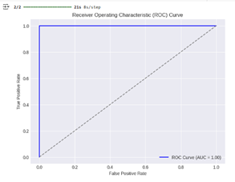  

Pada Gambar 13, yang digunakan untuk mengevaluasi kinerja model klasifikasi. Kurva ROC menunjukkan hubungan antara True Positive Rate (Sensitivity) dan False Positive Rate pada berbagai threshold.Dalam grafik ini, garis biru menunjukkan kurva ROC model dengan Area Under the Curve (AUC) = 1.00, yang menandakan bahwa model memiliki performa sempurna dalam membedakan antara kelas positif dan negatif. Kurva yang menyentuh sudut kiri atas (0,1) tanpa menyimpang menunjukkan bahwa model memiliki sensitivitas 100% dan spesifisitas 100%, tanpa kesalahan klasifikasi. Hasil ini mengindikasikan bahwa model sangat baik dalam memprediksi kelas positif dan negatif, namun perlu dilakukan validasi lebih lanjut untuk memastikan tidak terjadi overfitting.  
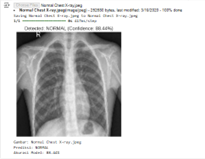  
Gambar 14  menunjukkan hasil prediksi model deep learning pada citra X-ray dada, di mana model mengklasifikasikan gambar sebagai NORMAL dengan tingkat kepercayaan sebesar 88.44%. Informasi yang ditampilkan mencakup nama file gambar "Normal Chest X-ray.jpeg", hasil prediksi model yang menyatakan kondisi paru-paru dalam keadaan normal, serta akurasi prediksi sebesar 88.44%. Hasil ini mengindikasikan bahwa model cukup yakin dalam mengidentifikasi kondisi paru-paru yang sehat berdasarkan citra X-ray. Namun, meskipun tingkat kepercayaan model cukup tinggi, dalam praktik medis tetap diperlukan validasi lebih lanjut oleh dokter spesialis radiologi untuk memastikan diagnosis yang lebih akurat. 
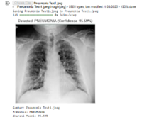  
Gambar 15 menunjukkan hasil prediksi model deep learning pada citra X-ray dada, di mana model mengklasifikasikan gambar sebagai PNEUMONIA dengan tingkat kepercayaan sebesar 95.59%. Informasi yang ditampilkan meliputi nama file gambar "Pneumonia Test1.jpeg", hasil prediksi yang menunjukkan bahwa pasien kemungkinan besar mengalami pneumonia, serta akurasi model dalam memberikan prediksi ini sebesar 95.59%. Tingkat kepercayaan yang tinggi menunjukkan bahwa model cukup yakin dengan diagnosisnya. Namun, dalam praktik medis, hasil ini tetap harus dikonfirmasi lebih lanjut oleh dokter spesialis radiologi untuk memastikan diagnosis yang lebih akurat sebelum menentukan langkah pengobatan yang tepat.  

# BAB IV KESIMPULAN  
Penelitian ini berhasil mengembangkan model deep learning berbasis Convolutional Neural Network (CNN) dengan arsitektur VGG16 untuk mendeteksi pneumonia akibat COVID-19 dari citra X-ray paru-paru. Model yang dikembangkan menunjukkan performa yang sangat baik, dengan akurasi mencapai 98% serta precision, recall, dan F1-score yang tinggi untuk kategori NORMAL dan PNEUMONIA. Evaluasi menggunakan confusion matrix dan ROC curve menunjukkan bahwa model memiliki sensitivitas dan spesifisitas yang optimal dalam membedakan kondisi paru-paru yang sehat dan terinfeksi.  

Meskipun hasilnya menjanjikan, penelitian ini memiliki beberapa keterbatasan, terutama dalam hal jumlah dataset yang terbatas dan variasi kualitas citra X-ray yang digunakan. Faktor ini dapat mempengaruhi generalisasi model saat diterapkan pada data baru dengan karakteristik berbeda. Selain itu, interpretabilitas model bagi tenaga medis masih perlu ditingkatkan agar lebih mudah dipahami dan digunakan dalam praktik klinis.  

Untuk penelitian di masa depan, disarankan untuk memperluas dataset dengan sumber yang lebih beragam guna meningkatkan robustitas model. Eksplorasi arsitektur deep learning lainnya, seperti ResNet atau EfficientNet, dapat dilakukan untuk meningkatkan akurasi serta efisiensi komputasi. Selain itu, pengembangan sistem berbasis web atau aplikasi dapat menjadi langkah strategis untuk mendukung implementasi model ini dalam dunia medis, sehingga dapat digunakan sebagai alat bantu diagnosis yang lebih praktis dan mudah diakses oleh tenaga kesehatan.  

# DAFTAR PUSTAKA  
[1] Dr. Sunil L. Bangare, Hrushikesh S. Rajankar, Pavan S. Patil, Karan V. Nakum, & Gopal S. Paraskar. (2022). Pneumonia Detection and Classification using CNN and VGG16. International Journal of Advanced Research in Science, Communication and Technology, 2(3), 771–779. https://doi.org/10.48175/ijarsct-3851  
[2] Fitriani, L., Latifah, A., & Cahyadiputra, M. R. (2024). Image Classification of Room Tidiness Using VGGNet with Data Augmentation. JUITA : Jurnal Informatika, 12(1), 111. https://doi.org/10.30595/juita.v12i1.21204  
[3] Gao, T. (2020). Chest X-ray image analysis and classification for COVID-19 pneumonia detection using Deep CNN. MedRxiv, 2020.08.20.20178913. https://www.medrxiv.org/content/10.1101/2020.08.20.20178913v2%0Ahttps://www.medrxiv.org/content/10.1101/2020.08.20.20178913v2.abstract  
[4] Sharma, S., & Guleria, K. (2022). A Deep Learning based model for the Detection of Pneumonia from Chest X-Ray Images using VGG-16 and Neural Networks. Procedia Computer Science, 218, 357–366. https://doi.org/10.1016/j.procs.2023.01.018  
[5] Usama, S., Safwan, S., Bukhari, K., Syed, A., & Sajid, S. (2020). The evaluation of convolutional neural network (CNN) for the assessment of chest X-ray of COVID-19 patients. Annals of Clinical and Analytical Medicine, 11(06). https://doi.org/10.4328/acam.20175  

